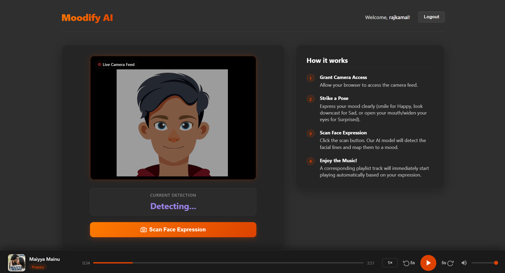
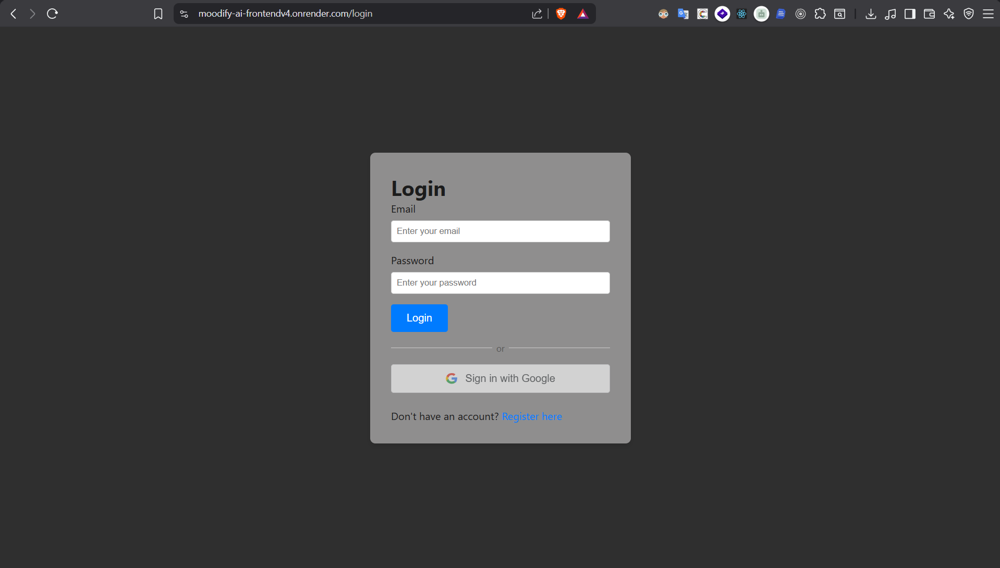

# Moodify AI

your face decides the music. that's the whole idea.

Moodify AI scans your facial expression through your webcam, figures out what mood you're in, and immediately starts playing a song that matches it. no searching, no scrolling, no "i don't know what to listen to" spiral.

**live demo →** https://moodify-ai-frontendv4.onrender.com

---

## screenshots


*face scan in action — detected mood shows up and the player kicks in automatically*


*login with email or google*

---

## how it works

1. **grant camera access** — let the browser see you
2. **strike a pose** — make a clear expression (smile, look sad, look surprised, etc.)
3. **hit "Scan Face Expression"** — the AI reads your facial lines and maps them to a mood
4. **music plays** — a matching track starts immediately at the bottom player

moods it can detect: Happy, Sad, Surprised, and more depending on what expression you pull

---

## features

- live webcam-based facial emotion detection
- auto-plays music based on detected mood
- built-in music player (no redirects, plays right there)
- user accounts — email/password or Google sign-in
- clean dark UI

---

## running locally

you need Node.js installed.

```bash
git clone https://github.com/Rajkamal017/Moodify_AI.git
cd Moodify_AI
```

**backend** (open a terminal):
```bash
cd Backend
npm install
npm start
```

**frontend** (open another terminal):
```bash
cd Frontend
npm install
npm start
```

then go to `http://localhost:3000`

> if you're setting up env variables (API keys, DB config, etc.), create a `.env` file in the Backend folder. check the backend code for what's needed.

---

## project structure

```
Moodify_AI/
├── Backend/    # handles auth, mood logic, music data
└── Frontend/   # React + SCSS, all the UI stuff
```

---

## tech used

- React, JavaScript, SCSS
- Node.js backend
- face-api.js (or similar) for emotion detection
- Google OAuth for login
- deployed on Render

---

## todo

- [ ] improve detection accuracy for edge cases
- [ ] expand the music library per mood
- [ ] mobile support
- [ ] show mood history over time

---

built this as a personal project. still actively improving it — if something breaks or you have ideas, open an issue.
